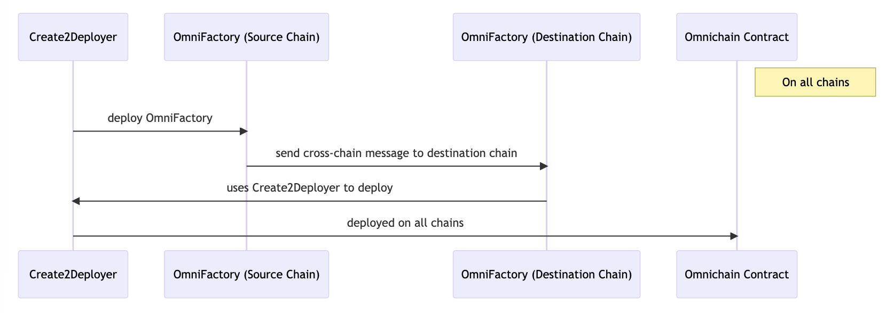
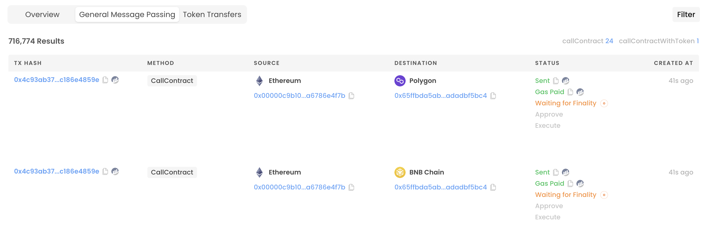

# OmmniDeployer

## Description

OmniDeployer provides an omnichain deployer interface along with a Hardhat plugin to interact seamlessly with this interface. It leverages the power of Axelar's cross-chain messaging system to facilitate cross-chain deployment transactions.

## Live App

https://omni-deployer.vercel.app/

## Demo Video

coming soon!

## Pitch Deck

coming soon!

## Problem Statement

Deploying the same contract on multiple chains can be cumbersome. It requires specific configurations and necessitates the possession of native tokens to initiate transactions. Furthermore, maintaining a consistent address across multiple chains can be technically challenging and time-consuming.

## Benefit

OmniDeployer addresses these challenges head-on by introducing a streamlined Hardhat plugin and user interface:

- Users can easily input contract details into the plugin.
- The UI lets users select their desired network.
- With a single transaction, all deployments are executed, courtesy of Axelar's cross-chain messaging.

This drastically enhances the efficiency of multi-chain smart contract deployment, making the entire process seamless and user-friendly.

## Technical Details

At its core, OmniDeployer operates by having the same address deployed to all chains. This address, referred to as OmnichainDeployer, is intricately connected with AxelarExecutable. As a result, OmniDeployer can initiate deployment transactions across all chains from a singular chain, exemplifying the power and utility of Axelar's cross-chain capabilities.



### Plugin Usage

#### Hardhat config

```
import "./plugins/hardhat-omnideployer";
```

#### Script

```
import { ommniDeploy } from "hardhat";

async function main() {
  ommniDeploy(true, "Sample", ["test"]);
}
```

#### Expected Result

```
=== OmmniDeploy with Axelar Network ===
>> gui mode true
>> contractName Sample
>> constractorArguments [ 'test' ]
>> sourceChain ethereum-2
>> salt 0x00000000000000000000000000...
>> signer 0x00000c9b10039702e0587E587623f6a6786e4F7B
>> create2DeployerAddress 0x29ccc23fe0c0dce6b929f4f8d81607ad66a48cde
>> omniFactoryAddress 0xe20Cc7d5DD900301A7989c7A6775315AF99f73fe
>> expectedDeployedAddress 0x951f95039D2Bca4dcFc054fb2abb83b7b303D742
>> gui mode enabled
>> service uri https://omni-deployer.vercel.app/ // this is path to UI
>> creationCode 0x608060405234801561...
>> salt 0x00000000000000000000000000...
```

#### Interact with Frontend


### Multiple Omni Deployment Tx

#### Transaction Hash

https://goerli.etherscan.io/tx/0x57c110d365f196a50483f93b602e67434990928c3635bdbf34435f113beea4f3

#### Axelar Scan

- One transaction sends multiple Axelar cross-chain messages



### Single Omni Deployment for Tx Detail

#### Source chain Tx

https://goerli.etherscan.io/tx/0xc6a1c9c8a1502203180b4d6d10cbabbd8615613aee7676647c6903d420b372b0

#### Axelar Scan

https://testnet.axelarscan.io/gmp/0xc6a1c9c8a1502203180b4d6d10cbabbd8615613aee7676647c6903d420b372b0

#### Destination Chain Tx

https://mumbai.polygonscan.com/tx/0xfcd9c1adeccee5f918bc55c04f2a73b3ecc08a27ee0362ad8c5d0af0105f7dca

#### Destination Deployed Contract

https://mumbai.polygonscan.com/address/0xe3f3db12355db5d8094fc1f77fe56b96536bc758
